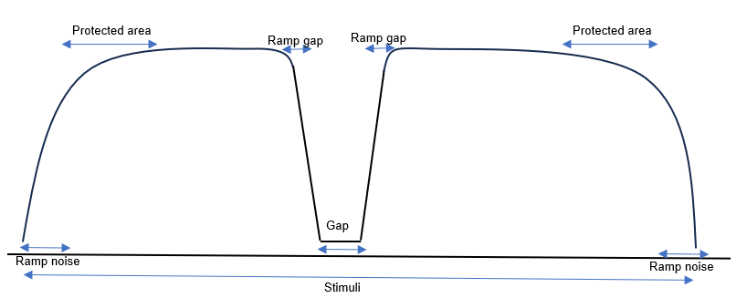

# GapDetection

A MATLAB application for **gap-in-noise detection**, a psychoacoustic measure of auditory
temporal resolution. It estimates a listener's gap threshold with an adaptive procedure,
then measures the full psychometric function around it. Developed at the Hearing Institute
(Institut Pasteur, Paris) and used with patients with auditory neuropathy spectrum disorder.

## The test

Each trial presents 800 ms of white noise containing a silent gap at a random position.
The listener reports whether they heard a gap; answers and reaction times are recorded.

1. **Rough threshold (adaptive).** Up to 30 trials; gap duration decreases after a detection
   and increases after a miss. The run stops early if the gap exceeds 100 ms, reaches 0 ms,
   or the same minimum is reached twice.
2. **Psychometric function.** Gap durations around the rough threshold are presented in
   random order, 10 repetitions each (100 trials), independent of previous answers. The output
   is the proportion of detections as a function of gap duration.

Normal-hearing listeners typically detect gaps of about 4 ms; listeners with auditory
nerve disorders often need 20 ms or more.

### Stimulus defaults (all adjustable in the GUI)

| Parameter | Default |
|---|---|
| Noise duration | 800 ms, white noise |
| Presentation level | 65 dB |
| Sampling rate | 48 kHz |
| Onset/offset ramps (noise) | 20 ms, Hanning |
| Onset/offset ramps (gap) | 2 ms |
| Protected area | 30 ms from stimulus and gap edges, so gaps are never truncated |
| Gap duration range | 1–60 ms (psychometric stage) |

Ramps avoid spectral splatter (audible clicks) at every transition.

## Usage

1. Open MATLAB (developed and tested on **R2023a**) in this folder.
2. Run `guiGap`.
3. Select the audio output device and **calibrate** each ear: the app plays a reference
   stimulus and asks for the level measured with a sound level meter.
4. Enter the participant identifier and run the two stages.

Results are saved as CSV, one file per stage:
`YYYY-MM-DD_HH-MM-SS_<id>_threshold.csv` and `YYYY-MM-DD_HH-MM-SS_<id>_psycho.csv`,
with every stimulus parameter, the answer and the response delay for each trial.

## Code structure

| File | Role |
|---|---|
| `guiGap.mlapp` | Graphical interface |
| `GapPresentation.m` | Stimulus synthesis and playback |
| `FindThreshold.m` | Adaptive rough-threshold stage |
| `PlotPsychometric.m` | Psychometric stage and plot |
| `CalibrationGap.m` | Per-ear level calibration |
| `AudioTool.m` | Audio device discovery |

## Authors

Marta Campi, Grégory Gérenton, Eva Thurot — Hearing Institute, Institut Pasteur, Paris.
Contact: gregory.gerenton@pasteur.fr

## License

GNU General Public License v3.0 — see [LICENSE](LICENSE).
